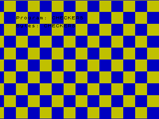

ZX Spectrum 48/128 "Racing the Beam" Experiments
=====

This repo contains set of experiments for **racing the beam** and **opening the border** on ZX Spectrum 48K.
 - *racing the beam* - is the besis of multicolour effects that defy 8x8 color attributes,
 - *opening the border* - allows to draw outside of the normal video memory area.

Both techniques require precise cycle timing which is complicated on ZX Spectrum 48/128K due to [memory contention](https://sinclair.wiki.zxnet.co.uk/wiki/Contended_memory).

<p align="center" width="100%">
    
</p>

## Prerequistes and tools

Tools for Mac OSX are included directly in the repository and should not require any additional installation. (**HELP NEEDED**: *Setup for Windows and Unix!*)

- Emulator: [Fuse](https://fuse-emulator.sourceforge.net), [Fuse for Mac OSX](https://fuse-for-macosx.sourceforge.io)
- Assembler: [zmac](http://48k.ca/zmac.html)

## What next

First run `checkers` that draws on the border. Executing for the following commmand will compile `checkers.asm` file, produce `checkers.tap` tape file and execute the emulator.

```make checkers```

Next look at `interrupt_mode2.asm`. It provides predictable frame timing and explains at which cycle exactly frame starts.

```make interrupt_mode2```

Finally look at `checkers_hscroll.asm` which willl draw animated checkerboard across the whole screen including border.

```make checkers_hscroll```

This code races the beam and deals with [memory contention](https://sinclair.wiki.zxnet.co.uk/wiki/Contended_memory).
(**HELP NEEDED**: *Update code to run with 128K timing*)

See if you could re-implement it with less code or make it more readable?

### Setting up Build & Run in Sublime Text 

1) Open your **Sublime Text** editor and chose Tools ▶ Build System ▶ New Build System…
2) Copy contents of the [ZXasm.sublime-build](ZXasm.sublime-build) into newly create sublime-build script, save with `ZXasm.sublime-build` name.
3) Pick any `.asm` file in the project, chose Tools ▶ Build System and specify `ZXasm`.
Now you can use Command+B (or Ctrl+B) to build & launch emulator!

For more information see [Sublime build system docs](https://www.sublimetext.com/docs/build_systems.html)

### Adding new .asm file 

1) Create new `my_new_experiment.asm`
2) Add to [Makefile](Makefile): `TAPES+=my_new_experiment.tap`
3) Now you can use:

```make my_new_experiment```


## TODO
- Setup for Windows and Unix!
- Move generated and temporary files into /output folder
- Port `checkers.asm` and `checkers_hscroll.asm` to work on 128K/+2/+2A/+3, currently only 48K is supported. Each model of Spectrum unfortunately has slightly different timing :(
- Measure and update T cycles timings in `interrupt_mode2.asm` by running on 128K/+2/+2A/+3 emulated machines.
- Implement 64x48 multicolour by flipping between screen pages on 128K.
- AY at 200Mhz
- Investigate if custom code generator (say with Python) instead of zmac would simplify cycle exact code genereation
